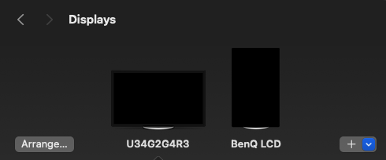

# Bit Therapy C++

## What is this project?
This is a C++ porting of my Swift macOS app [BitTherapy](https://apps.apple.com/app/desktop-pets/id1575542220), hopefully it will run on Windows some day!

I'm using this project to **learn C++**, so it's gonna take a while.

## ⏳ Status

### ✅ What's working
* Basic Command line interface
* Multi-monitor support
* Multi-pet support
* Tests are passing

### ⏳ Coming soon
* Support for most capabilities available in Swift

### ❌ Known issues
* n/a

## 🛠️ Building 
```bash
cd Sources/cpp
brew install googletests
brew install cmake
cd scripts
sh build.sh
./Main --species ape --species betta --screen ben
```

## 🚀 Running
Well, first follow the building steps, then tou can run the app from the command line, on any number of monitors with any number of pets.<br>
Run with `--help` for more information.

```
Allowed options:
  -h [ --help ]         Shows this help message
  --species arg         Species of pets to spawn (required)
  --screen arg          Monitors the app will display on (part of the name)
  --debug               Enable debug hud
```

### `--species`
The ids of the species you want to display...<br>
The list of bundled-in species is available [here](https://github.com/curzel-it/bit-therapy/tree/main/Species).<br>
For example:
* `--species betta` Shows a betta fish
* `--species ape --species betta` Shows an ape and betta fish
* At least one is required

### `--screen`
Monitors/screens are identified simply by part of the name.<br>
Here are some examples with the following setup:<br>
<br>
* `--screen u34` only runs the app on the "U34G2G4R3"
* `--screen ben` only runs the app on "BenQ LCD"
* `--screen u34 --screen ben` runs on both displays
* Omitting the `--screen` param runs on all available displays

## ⚙️ Testing
```bash
cd Sources/cpp
brew install googletests
brew install cmake
cd scripts
sh test.sh
```